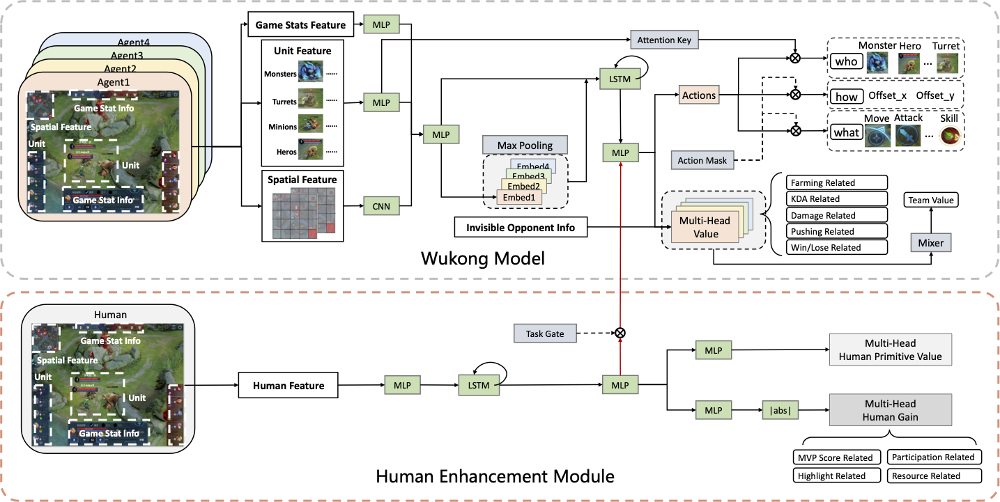

# RLHG -- Make You Better: Reinforcement Learning from Human Gain

## Environmental Requirements
- numpy == 1.18.5
- tensorflow == 1.15.5

## Detailed Model Structure
- Agent.py
- HumanEnhanceModule.py


## Demo
- Since the game engine and data are private and confidential, all data is faked using ```fake_data.py```.
- For infer:
  - ```python infer.py```
- For train:
  - Step I: Human Primitive Value Estimation
    - ```python train_human_primitive_value.py```
  - Step II: Human Enhancement Training
    - ```python train_agent.py```
